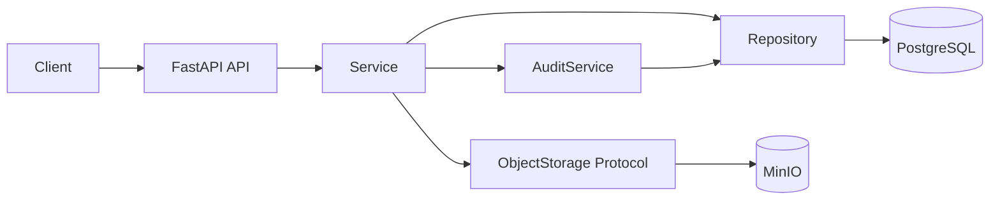

# 第一阶段架构

HTTP 层只做输入输出转换。Service 承担业务规则、事务边界和 PostgreSQL/MinIO 之间的显式补偿；
Repository 只负责数据库访问；`ObjectStorage` 隔离 MinIO SDK。证据对象路径完全由服务端构造：
`cases/{case_id}/evidence/{evidence_id}/{safe_filename}`。

MinIO 写入成功而 DB 操作失败时，服务尝试删除对象；补偿失败会记录明确错误，未来可由孤儿对象清理任务
对账。这不是跨系统 ACID 事务。

`app/graph` 和 `app/agents` 只是扩展边界，不包含伪实现。
