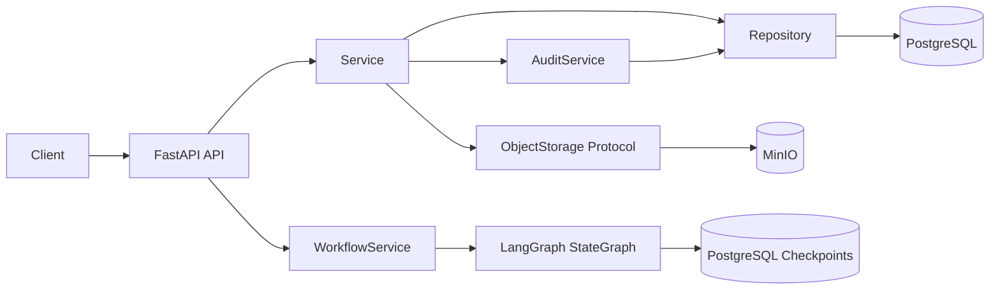

# 第一阶段架构

HTTP 层只做输入输出转换。Service 承担业务规则、事务边界和 PostgreSQL/MinIO 之间的显式补偿；
Repository 只负责数据库访问；`ObjectStorage` 隔离 MinIO SDK。证据对象路径完全由服务端构造：
`cases/{case_id}/evidence/{evidence_id}/{safe_filename}`。

MinIO 写入成功而 DB 操作失败时，服务尝试删除对象；补偿失败会记录明确错误，未来可由孤儿对象清理任务
对账。这不是跨系统 ACID 事务。

最小图在 `human_review(interrupt)` 后支持批准归档、退回重研、等待补证和终止四条分支。
补证分支使用第二个 `await_evidence(interrupt)` 暂停点；确认材料就绪后重新统计证据并进入下一轮复核。
图状态包含案件标识、证据数量、预研判摘要、复核轮次和复核记录，不保存证据正文。
`thread_id` 用于跨请求和服务重启定位 checkpoint。

`app/agents` 仍只是扩展边界，不包含业务 Agent 伪实现。
