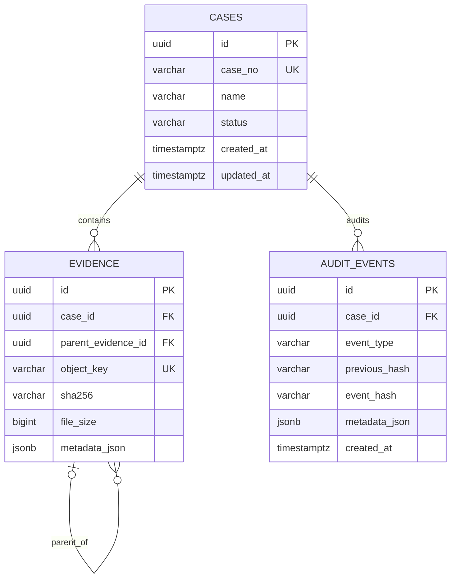

# 数据库设计

内部主键均为 UUID。`case_number_seq` 并发安全地产生 `CASE-{year}-{sequence}` 业务编号。
`evidence(case_id, sha256)` 唯一约束保证案件内证据幂等。

审计事件按案件串链，哈希为 `SHA256(previous_hash + canonical_event_content)`；规范 JSON 固定
key 排序、UTF-8、UTC ISO 时间。数据库触发器拒绝审计表的 UPDATE/DELETE，使应用约束同时得到数据库
保护。该链是完整性增强机制，不等同于司法电子取证认证。

## LangGraph checkpoint 表

`checkpoint_migrations`、`checkpoints`、`checkpoint_blobs` 和 `checkpoint_writes` 由官方
`langgraph-checkpoint-postgres` 的 `setup()` 维护。它们属于第三方运行时内部 schema，不由业务
Alembic migration 重复管理。应用只以稳定 `thread_id` 读取和恢复状态，不直接修改这些表。
