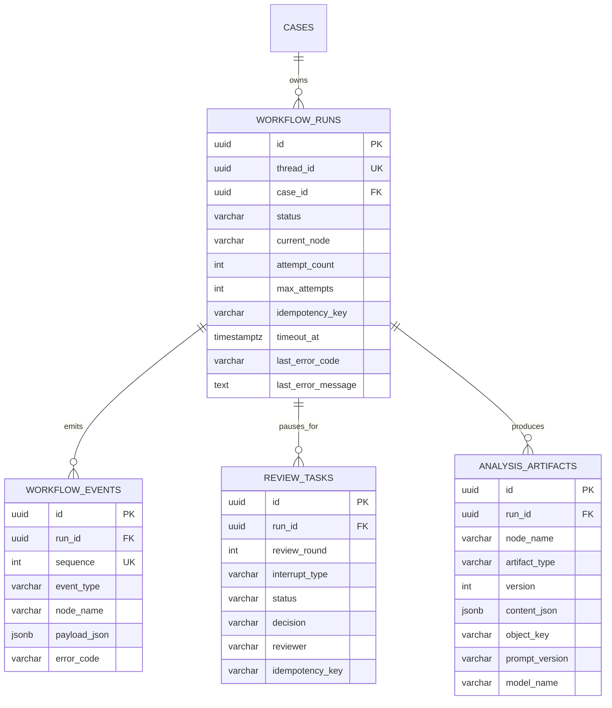

# 工作流业务持久化

LangGraph checkpoint 与业务记录承担不同职责：checkpoint 用于恢复图执行；业务表用于管理查询、时间线、失败处理、人工复核和分析结果审计。

## 数据模型



`workflow_events` 是追加写表，数据库触发器拒绝 UPDATE 和 DELETE。事件序号在单个 run 内从 1 连续递增。

## 状态与事件

业务运行状态：`CREATED`、`RUNNING`、`WAITING_REVIEW`、`WAITING_EVIDENCE`、`COMPLETED`、`CANCELLED`、`FAILED`、`TIMED_OUT`。

Graph 使用 `stream_mode="tasks"` 发出节点开始与结束信息，业务层写入：

- `NODE_STARTED`
- `NODE_COMPLETED`
- `WORKFLOW_PAUSED`
- `WORKFLOW_RESUMED`
- `REVIEW_DECIDED`
- `ARTIFACT_CREATED`
- `WORKFLOW_COMPLETED`
- `WORKFLOW_FAILED`
- `WORKFLOW_RETRYING`
- `WORKFLOW_CANCELLED`
- `WORKFLOW_TIMED_OUT`

节点异常时，最近一次 LangGraph checkpoint 保持不变，`workflow_runs` 写入 `FAILED`、失败节点、错误类型和错误摘要。重试会增加 `attempt_count`；如果人工决定已提交但 Graph 尚未消费，重试会从 `review_tasks` 重放该决定。

## 幂等、超时和取消

- 启动接口接受 `idempotency_key`，同一案件和幂等键返回原 `thread_id`。
- 恢复接口接受 `idempotency_key`，重复人工决定不会再次推进 Graph。
- `max_attempts` 限制失败重试次数。
- `timeout_seconds` 设置运行截止时间；读取或恢复时会检查并持久化 `TIMED_OUT`。
- 取消接口把业务 run 置为 `CANCELLED`，取消待处理复核任务，并阻止后续 resume。

当前超时检查是访问触发式，没有独立定时扫描器；部署任务执行器后应增加周期性超时扫描。

## API

```text
POST /api/v1/cases/{case_id}/workflows
GET  /api/v1/workflows/{thread_id}
GET  /api/v1/workflows/{thread_id}/timeline
GET  /api/v1/workflows/{thread_id}/events
POST /api/v1/workflows/{thread_id}/resume
POST /api/v1/workflows/{thread_id}/retry
POST /api/v1/workflows/{thread_id}/cancel
```

SSE 同时发送 `workflow_snapshot` 和可重放的 `workflow_event`。`timeline` 返回 run、events、reviews 和 artifacts 的完整业务视图。

## 当前事务边界

LangGraph checkpointer 与 SQLAlchemy 业务表使用不同数据库连接，无法形成单个数据库事务。业务服务采用以下协调策略：

1. 业务 run 和请求事件先提交。
2. LangGraph 以 `durability="sync"` 执行节点并写 checkpoint。
3. 每个 task 事件和分析产物立即提交。
4. 最终 snapshot 同步回业务 run。
5. 异常写入 `FAILED`；访问时可通过 checkpoint 与业务 run 对账。

后续引入异步 Worker 时，应增加租约、心跳扫描和自动对账任务。
